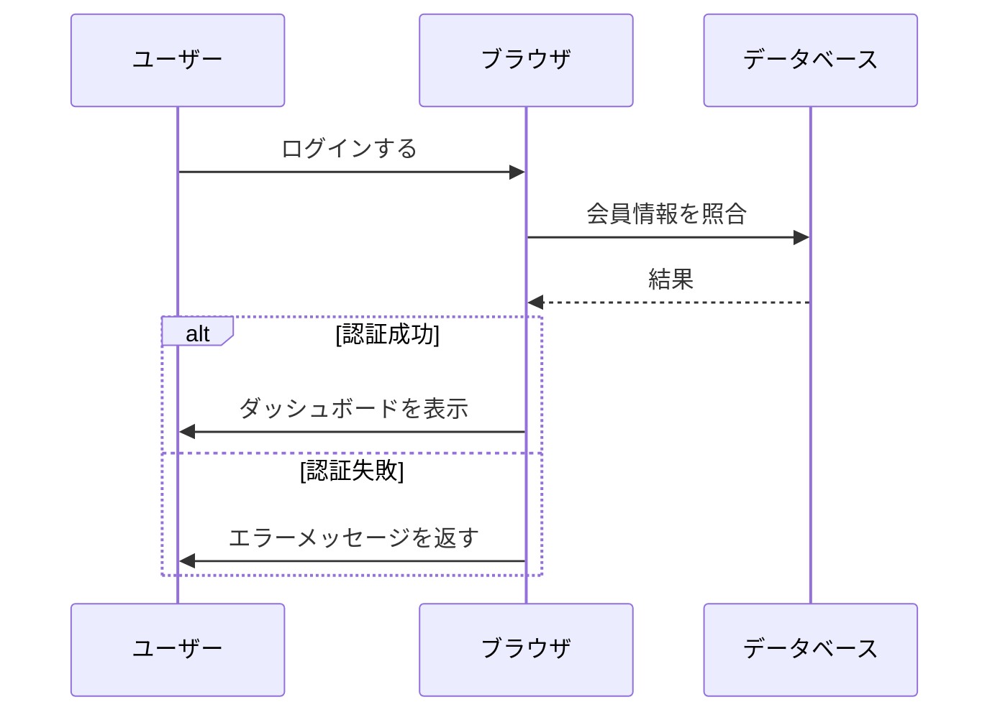

```mermaid
sequenceDiagram
    participant ユーザー
    participant ブラウザ
    participant データベース
    ユーザー->>ブラウザ:ログインする
    ブラウザ->>データベース:会員情報を照合
    データベース-->>ブラウザ:結果

    alt 認証成功
        ブラウザ->>ユーザー:ダッシュボードを表示
    else　認証失敗
        ブラウザ->>ユーザー:エラーメッセージを返す
    end

```